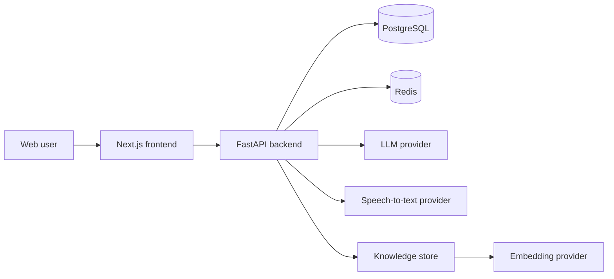

# MeetBridge AI architecture

## Runtime view

## AWS deployment target

### Core services
- Application Load Balancer in front of the frontend and API containers
- ECS Fargate or EKS for stateless app services
- RDS PostgreSQL for tenant and meeting metadata
- ElastiCache Redis for session and cache state
- S3 or EBS-backed object storage for secure uploads and retention policies
- CloudWatch Logs + metrics for observability and alerting
- Secrets Manager for JWT signing key and provider credentials

### Recommended topology
- Internet-facing ALB forwards to frontend and API containers
- API service runs private behind the ALB
- Database and Redis remain in private subnets
- Only the ALB and required ingress paths are public
- WAF + TLS termination at the edge for production traffic

## Security boundaries
- tenant-aware authorization on every shared resource
- audit events for privileged actions and data access
- strict retention controls for audio and uploaded artifacts
- secret rotation with environment-managed credentials

## Release notes
MeetBridge AI is designed as a modular SaaS workflow: auth, meetings, state, retrieval, evaluation, and production readiness are layered in order. The architecture keeps core logic decoupled from external providers so providers can be swapped without rewriting application behavior.
